Description of deliverable
==========================

After implementation and internal release of the prototype implementation of the software framework, the software has undergone testing before making a first public release.

Testing has been carried out on simple, generic examples and a baseline application for an expanding polyurethane foam which has been augmented with multi-scale capabilites using the MoDeNa software framework. The model includes a simple but realistic representation of the polymerization kinetics and accounts for the presence of a physical and chemical blowing agent.

The work has been carried out within task 5.5.

Summary of contribution of involved partners
============================================

WIKKI carried out the implementation of the software framework and two tank example. NTNU contributed a documentation of the database structure and two tank example. POLITO contributed the 0D model and testing resuls. The deliverable forms the basis of the first release and will be used by used by POLITO, BASF, VCSHT, US and UNITS for the implementation of the recipies and adaptors for the demonstration cases.

Introduction
============

The project aims at developing, demonstrating and assessing an easy-to-use multi-scale software framework application under an open-source licensing scheme that delivers models with feasible computational loads for process and product design of complex materials. The concept of is an interconnected multi-scale software framework. Four scales will be linked together by this framework namely the nano-, micro-, meso-, and macroscale (see Figure 1). As application cases we consider polyurethane foams (PU), which are excellent examples of a large turnover product produced in a variety of qualities and of which the properties are the result of designing and controlling the material structure on all levels of scale, from the molecule to the final product.

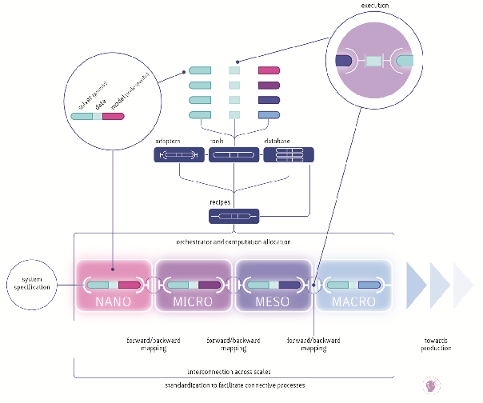{#fig:ConceptualStructure}

Multi-scale coupling requires the exchange of information between software instances developed for specific scales in a consistent way. In order to achieve this, generating consistent representations for models and data is necessary. The information exchange is governed by protocols and may occur in two ways, namely:

-   “forward mapping” (passing information from the microscopic to the macroscopic scale in upward direction)

-   “backward mapping” (passing information from the macroscopic to the microscopic scale in downward direction)

“Forward mapping” is relatively straightforward, while “backward mapping” inevitably requires iteration since changing the operating conditions at the fine level changes the feedback to the coarse level. “Backward mapping” can be realised by “two-way coupling” or by “fitting surrogate models”. The first approach usually requires exchange of large amounts of data during runtime that may be expensive either due to the complexity of the data exchange or the computational cost associated with executing the microscopic-scale simulation. In such cases, replacing the microscopic-scale simulation with a surrogate model presents the only viable alternative. This operation inherently constitutes a transfer of data across scales and is unique in that it focuses on this approach.

A typical operation sequence starts a macroscopic-scale simulation which instantiates one or more surrogate models. When the validity of a model is violated, a design of experiment operation is triggered. It creates inputs for a set of microscopic-scale simulations. When all experiments are finished, the parameter estimation component is invoked which updates the model parameters. Next, the macroscopic-scale simulation is restarted. It should be noted, that the software framework supports application and model dependencies across multiple scales.

Software Framework
==================

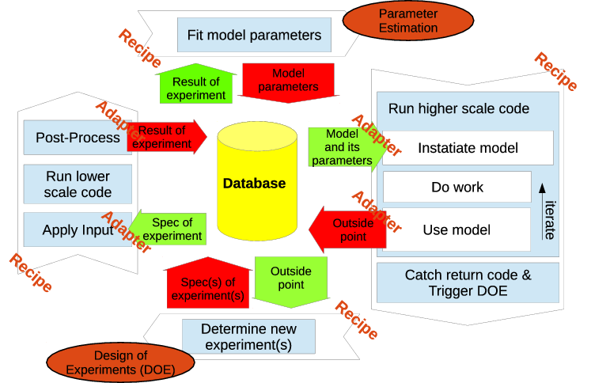{#fig:DataFlow}

The software framework handles the communication across scales through recipes and adapters as shown in Figure 1 and 2 . Recipes perform simulations by executing applications (in-house codes or external software packages such as FOAM, Materials Studio, Predici) for a given set of inputs. Adapters handle the communication with the software framework. Both, recipes and adapters are application specific. Adapters exist as outgoing and incoming adapters. Outgoing adapters are relatively straight forward in that they perform a mapping operation (such as averaging) and communicate the results. The averaging process may have to be started and performed within the application (e.g. for time averaging). However, the results can usually be submitted in a separate process after the simulation is finished. Incoming adapters are more complicated since they usually require to embed surrogate models within the applications.

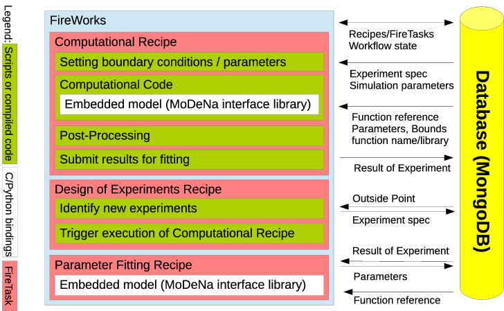{#fig:SoftwareStack}

As shown in Figure 2, the software framework consists of an orchestrator, a database and a interface library. The orchestrator is based on FireWorks F. project (2015) and constitutes the backbone of the software framework in that it schedules simulations as well as design of experiments and parameter estimation operations which make up the work-flow of the overall simulation. It is very much like a dynamic work-flow engine, in which the different applications are “orchestrated” to obtain information, analyse and pass it to the other operations. The <span><span><span style="font-variant:small-caps;">NoSQL</span></span></span> database <span><span><span style="font-variant:small-caps;">MongoDB</span></span></span> MongoDB project (2015) is used to store the state of the work-flow as well as the surrogate models together with associated data such as model parameters, data used for parameter estimation, and meta-data.

The interface library consists of two parts: A high-level python module providing access to the database as well as design of experiments and parameter estimation capabilities by building on MongoEngine MongoEngine project (2015) and R R. project (2015), respectively. The second part is a low-level library providing unified access to the surrogate models. This component is written in C to ensure interoperability across platforms and target applications while providing the computationally efficient model execution required by the applications. The library is loaded as a shared library by the macroscopic-scale applications or as a native python extension by the high-level python module ensuring that all components instantiate identical model implementations. Complex operations such as database access are referred back to the high-level python module using call-back mechanisms.

Database concept
================

A database can be defined as an organized collection of data which enables us to handle large quantities of information by inputting, storing, retrieving and managing them. A relational database is defined as a database in which the data is organized based on the relational model of data. Codd (1970) The purpose of this model is to provide a declarative method for data and query specification. Relational databases mostly use structured query language (<span><span><span style="font-variant:small-caps;">SQL</span></span></span>) which can also be used as a term to describe a relational database.

Non-relational databases, dubbed as <span><span><span style="font-variant:small-caps;">NoSQL</span></span></span> (Not Only <span><span><span style="font-variant:small-caps;">SQL</span></span></span>), provide a mechanism for storage and retrieval of data which is modeled in a way different than in a relational database. N<span>ä</span>sholm (2012) <span><span><span style="font-variant:small-caps;">NoSQL</span></span></span> databases are of interest in project since they allow database schemas which adapt to the users needs in a seemless manner. <span><span><span style="font-variant:small-caps;">MongoDB</span></span></span> is a auch a <span><span><span style="font-variant:small-caps;">NoSQL</span></span></span> document store database written in <span><span><span style="font-variant:small-caps;">C++</span></span></span> and developed in an open-source project by the company 10gen Inc. The motivation behind its development is to close the gap between the fast and highly scalable key-value-stores and feature-rich traditional relational database management systems. Shermin (2013)

Some fundamental features of <span><span><span style="font-variant:small-caps;">MongoDB</span></span></span> are listed below to provide a more concrete insight and detailed information about the terminology and concepts:

-   Document database: A record in <span><span><span style="font-variant:small-caps;">MongoDB</span></span></span> is a document which is a data structure composed of field and value, or key and value pairs. The values of fields can also include other documents, arrays, and arrays of documents. <span><span><span style="font-variant:small-caps;">MongoDB</span></span></span> documents are in <span><span><span style="font-variant:small-caps;">BSON</span></span></span> (’Binary <span><span><span style="font-variant:small-caps;">JSON</span></span></span>’) data format. Essentially, it is a binary form for representing objects or documents. Using document is advantageous since the documents correspond to native data types in many programming languages, embedded documents (subdocuments) and arrays reduce need for expensive joins, and dynamic schema supports fluent polymorphis. Project (2014) In the documents, the value of a field can be any of the <span><span><span style="font-variant:small-caps;">BSON</span></span></span> data types, including other documents, arrays, and arrays of documents. <span><span><span style="font-variant:small-caps;">MongoDB</span></span></span> stores all documents in collections. A collection is a group of related documents that have a set of shared common indexes. Collections are analogous to a table in relational databases.

-   High performance: <span><span><span style="font-variant:small-caps;">MongoDB</span></span></span> provides high performance data persistence. In particular, support for embedded data models reduces I/O activity on database system, and indexes support faster queries and can include keys from embedded documents and arrays. Project (2014)

-   High availability: To provide high availability, <span><span><span style="font-variant:small-caps;">MongoDB</span></span></span>’s replication facility, called replica sets, provide automatic failover and data redundancy. A replica set is a group of <span><span><span style="font-variant:small-caps;">MongoDB</span></span></span> servers that maintain the same data set, providing redundancy and increasing data availability. Project (2014)

-   Automatic scaling: <span><span><span style="font-variant:small-caps;">MongoDB</span></span></span> provides horizontal scalability as part of its core functionality. Automatic sharding distributes data across a cluster of machines. Replica sets can provide eventually-consistent reads for low-latency high throughput deployment. Project (2014)

| <span><span><span style="font-variant:small-caps;">SQL</span></span></span>   | <span><span><span style="font-variant:small-caps;">MongoDB</span></span></span>                                                                                                    |
|:------------------------------------------------------------------------------|:-----------------------------------------------------------------------------------------------------------------------------------------------------------------------------------|
| Database                                                                      | Database                                                                                                                                                                           |
| Table                                                                         | Collection                                                                                                                                                                         |
| Row                                                                           | Document or <span><span><span style="font-variant:small-caps;">BSON</span></span></span> Document                                                                                  |
| Column                                                                        | Field                                                                                                                                                                              |
| Index                                                                         | Index                                                                                                                                                                              |
| Table joins                                                                   | Embedded documents and linking                                                                                                                                                     |
| Primary key (specify any unique column or column combinations as primary key) | Primary key (the primary key is automatically set to the <span><span>`_id`</span></span> field in <span><span><span style="font-variant:small-caps;">MongoDB</span></span></span>) |
| Aggregation (e.g. by group)                                                   | Aggregation pipeline                                                                                                                                                               |


To provide insight in <span><span><span style="font-variant:small-caps;">MongoDB</span></span></span> in a comparative manner with more widely used relational database (<span><span><span style="font-variant:small-caps;">SQL</span></span></span>) approach, terminology and concepts of these two are summarized and shown in the table above.

<span><span><span style="font-variant:small-caps;">MongoDB</span></span></span> implements the basic functions of data storage, initially defined for <span><span><span style="font-variant:small-caps;">SQL</span></span></span>: (create, read, update, delete) <span><span><span style="font-variant:small-caps;">CRUD</span></span></span>. In <span><span><span style="font-variant:small-caps;">MongoDB</span></span></span>, these are represented as query which corresponds to read operations while data modification stands for create, update and delete operations. In <span><span><span style="font-variant:small-caps;">MongoDB</span></span></span>, read operation is a query which targets a specific collection of documents. Queries specify criteria, or conditions, that identify the documents that <span><span><span style="font-variant:small-caps;">MongoDB</span></span></span> returns to the clients. A query may include a projection that specifies the fields from the matching documents to return.

<span><span><span style="font-variant:small-caps;">MongoDB</span></span></span> queries exhibit the following behavior:

-   All queries in <span><span><span style="font-variant:small-caps;">MongoDB</span></span></span> address a single collection.

-   Queries can be modified to impose limits, skips, and sort orders.

-   The order of documents returned by a query is not defined unless a `sort()` method is used.

-   Operations that modify existing documents use the same query syntax as queries to select documents to update.

-   In aggregation pipeline, the $ match pipeline stage provides access to <span><span><span style="font-variant:small-caps;">MongoDB</span></span></span> queries.

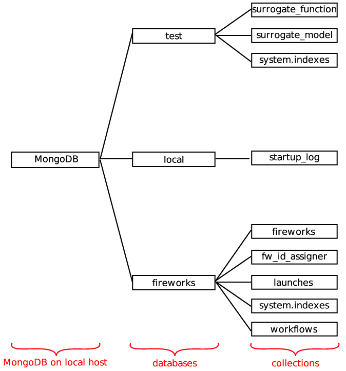{#fig:MongoDBlocal}

The project uses <span><span><span style="font-variant:small-caps;">MongoDB</span></span></span> for data storage. As shown in Figure 4, the database has a crucial role as it resides in the core of the flow of information. In <span><span><span style="font-variant:small-caps;">MongoDB</span></span></span>, when there is data insertion, default database named as <span><span>`test`</span></span> is automatically populated unless specified otherwise. The test database in project contains information regarding *work-flow*, *work-flow state*, *models*, *experiments*, *metadata*, *simulation context*. Moreover, the software, <span><span><span style="font-variant:small-caps;">Fireworks</span></span></span> used in the project also employs <span><span><span style="font-variant:small-caps;">MongoDB</span></span></span> for *work-flow* (FireTasks) storage in a database called as <span><span>`fireworks`</span></span>. In addition to <span><span>`test`</span></span> and <span><span>`fireworks`</span></span> databases, there is another database (<span><span>`local`</span></span>) that is automatically created by <span><span><span style="font-variant:small-caps;">MongoDB</span></span></span> for the purpose of saving log information. Figure 4 shows an illustration of the <span><span><span style="font-variant:small-caps;">MongoDB</span></span></span> databases and corresponding collections. As can be seen in Figure 4, there are three <span><span><span style="font-variant:small-caps;">MongoDB</span></span></span> databases (<span><span>`test`</span></span>, <span><span>`local`</span></span>, <span><span>`fireworks`</span></span>) on local host and their corresponding collections are also shown. In <span><span><span style="font-variant:small-caps;">MongoDB</span></span></span>, the system generates the name by concatenating the index key field and value with an underscore, e.g. <span><span>`cat_1.`</span></span>, if the user does not specify an index name Project (2014), and they are stored in a collection named as <span><span>`system.indexes`</span></span> which can be observed in the figure both for the <span><span>`test`</span></span> and <span><span>`fireworks`</span></span> databases. Each collection has at least one document which are not shown in the figure. Since the local database is generated by <span><span><span style="font-variant:small-caps;">MongoDB</span></span></span> and <span><span>`fireworks`</span></span> database structure is defined by the software itself, the main focus will be the test database which is developed within the scope of the project. For twoTank example in the project, data is stored in test database as well which has 3 collections: <span><span>`surrogate_function`</span></span>, <span><span>`surrogate_model`</span></span> and system.indexes. Each collection stores documents which consist of key and value pairs.

{#fig:surrogatefunction}

The collection, <span><span>`surrogate_function`</span></span> contains one single document with the keys: id of the function <span>`_id`</span>; class of the function, <span><span>`_cls`</span></span>; the global bounds for the function, <span><span>`inputs`</span></span> which are <span><span>`p0`</span></span>, <span><span>`rho0`</span></span>, <span><span>`p1Byp0`</span></span> and <span><span>`D`</span></span>, <span><span>`outputs`</span></span> which is <span><span>`flowRate`</span></span> and <span><span>`parameters`</span></span> which are <span><span>`param1`</span></span> and <span><span>`param2`</span></span> with global minimum value <span><span>`min`</span></span>, global maximum value <span><span>`max`</span></span> and argument position <span><span>`argPos`</span></span>; name of the function <span><span>`libraryName`</span></span>; compiled model in the library <span><span>`libraryName`</span></span>; <span><span><span style="font-variant:small-caps;">C</span></span></span>-code of the function for model execution and parameter estimation <span><span>`Ccode`</span></span>. All the mentioned keys and their value, and the hierarchy between them in terms of subdocuments constitute the database schema. The database schema is specified with corresponding keys and values in the initialization script except <span><span>`libraryName`</span></span> whose value is compiled in surrogatemodel script. To illustrate the data structure, data schema for <span><span>`surrogate_function`</span></span> collection is drawn with keys and it is shown in Figure 5. As can be seen in Figure 5, <span><span>`surrogate_function`</span></span> collection has one document which has 8 keys (<span><span>`_id`</span></span>, <span><span>`_cls`</span></span>, <span><span>`inputs`</span></span>, <span><span>`libraryName`</span></span>, <span><span>`outputs`</span></span>, <span><span>`libraryName`</span></span>, <span><span>`parameters`</span></span>, <span><span>`Ccode`</span></span>). Three of the keys store documents as values e.g. subdocuments (<span><span>`p0`</span></span>, <span><span>`rho0`</span></span>, <span><span>`p1Byp0`</span></span>, <span><span>`D`</span></span>, <span><span>`flowRate`</span></span>, <span><span>`param1`</span></span>, <span><span>`param2`</span></span>), and subdocuments also store documents (<span><span>`min`</span></span>, <span><span>`max`</span></span> and <span><span>`argPos`</span></span>). Thus, there are three levels of hierarchy in the data structure.

{#fig:surrogatemodel}

The collection, <span><span>`surrogate_model`</span></span> contains also one single document with the keys: class of the model, <span><span>`_cls`</span></span>; id of the model <span><span>`_id`</span></span>; Firework spec <span><span>`exactTask`</span></span> which has a name of <span><span>`_fw_name`</span></span>; fitting data <span><span>`fitData`</span></span> which are <span><span>`p0`</span></span>, <span><span>`rho0`</span></span>, <span><span>`p1Byp0`</span></span> and <span><span>`D`</span></span>; inherited inputs <span><span>`inherited_inputs`</span></span>; initialization strategy <span><span>`initializationStrategy`</span></span> which has <span><span>`initialPoints`</span></span> of <span><span>`p0`</span></span>, <span><span>`rho0`</span></span>, <span><span>`p1Byp0`</span></span> and <span><span>`D`</span></span>, and a name of <span><span>`_fw_name`</span></span>; the global bounds for the function, <span><span>`inputs`</span></span> which are <span><span>`p0`</span></span>, <span><span>`rho0`</span></span>, <span><span>`p1Byp0`</span></span> and <span><span>`D`</span></span> with global minimum value <span><span>`min`</span></span>, global maximum value <span><span>`max`</span></span>; number of sample points <span><span>`nSamples`</span></span>; determination of points outside of the bounds <span><span>`outOfBoundsStrategy`</span></span> and corresponding number of points <span><span>`nNewPoints`</span></span> and a name of <span><span>`_fw_name`</span></span>; output of the calculation <span><span>`outputs`</span></span> which is <span><span>`flowRate`</span></span> with global minimum value <span><span>`min`</span></span>, global maximum value <span><span>`max`</span></span>; parameter fitting strategy <span><span>`ParameterFittingStrategy`</span></span> with maximum error limit of <span><span>`maxerror`</span></span>, sub-strategy for improvement <span><span>`improveErrorStrategy`</span></span> and corresponding number of points <span><span>`nNewPoints`</span></span> and a name of <span><span>`_fw_name`</span></span>, maximum number of iterations <span><span>`maxIterations`</span></span>, name of <span><span>`_fw_name`</span></span> and <span><span>`testDataPercentage`</span></span>; <span><span>`parameters`</span></span>, corresponding function of the model <span><span>`surrogateFunction`</span></span> and calculated numbers outside of bounds <span><span>`outsidePoint`</span></span>. To illustrate the data structure, data schema for <span><span>`surrogate_model`</span></span> collection is drawn with keys and it is shown in Figure 6. As can be seen in Figure 6, <span><span>`surrogate_model`</span></span> collection has one document which has 14 keys (<span><span>`_id`</span></span>, <span><span>`fitData`</span></span>, <span><span>`inherited_inputs`</span></span>, <span><span>`initializationStrategy`</span></span>, <span><span>`exactTask`</span></span>, <span><span>`_cls`</span></span>, <span><span>`inputs`</span></span>, <span><span>`nSamples`</span></span>, <span><span>`surrogateFunction`</span></span>, <span><span>`outputs`</span></span>, <span><span>`outOfBoundsStrategy`</span></span>, <span><span>`parameters`</span></span>, <span><span>`ParameterFittingStrategy`</span></span>, <span><span>`outsidePoint`</span></span>). As described in Figure 6, keys store documents e.g. subdocuments. Thus, there are three levels of hierarchy in the data structure.

Testing on two tank example
===========================

Physical Description
--------------------

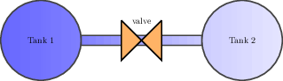{#fig:twoTanks}

“Two tanks” is a basic example designed to show the structure of the framework using a simple model of the discharge of air from one tank into another through a nozzle is considered as depepicted in Figure 7. In order for the example to makes sense from a perspective, the flow through the nozzle must be considered as a complex problem which that has to be solved using 3D <span><span>\(\mathrm{CFD}\)</span></span> or a different detailed model. Consequently, the two tanks are macroscopic models and the rate of discharge of fluid through the nozzle represents a microscopic model. Moreover, the example also demonstrates a backward mapping problem if the range of the inputs is assumed to be unknown apriori.

In the example, the dynamic simulation, describing the contents of the two tanks, uses the interface library to embed a surrogate model describing the rate of discharge of fluid through the nozzle. In other words, the file `twoTanksMacroscopicProblem.C` is the macroscopic scale. The microscopic scale, a detailed model describing the dischage of fluid, is implemented in `twoTanksFullProblem.C`. The latter is never explicitly executed by the macroscopic code, but through the framework when the surrogate model is out of bounds.

The micro scale model, shown in equation 1, was obtained from Chemieingenieurwesen (2010). 

\[{\ensuremath{Q}}= \pi {\ensuremath{D}}^2 {\ensuremath{C_d}}{\ensuremath{\phi}}\sqrt{ 2 {\ensuremath{p}}_1 {\ensuremath{\rho_{}}}} \label{eq:nozzleEquation}\] {#eq:nozzleEquation}

The variables of model, \({\ensuremath{p}}_1\) and \({\ensuremath{p}}_2\) describes the pressures in Tank 1 and Tank 2, respectively. <span><span>\(D\)</span></span> is the diameter of the nozzle and <span><span>\(\rho_{}\)</span></span> is the density of the fluid (air). The model parameters shown below are respectively an empirical correlation and derived from thermodynamic assumptions. 

\[\begin{aligned}
{\ensuremath{C_d}}&= 0.84-
      0.66 \displaystyle{ \left( \frac{{\ensuremath{p}}_2}{{\ensuremath{p}}_1} \right) }^2 +
      0.48 \displaystyle{ \left( \frac{{\ensuremath{p}}_2}{{\ensuremath{p}}_1} \right) }^3 \\
      {\ensuremath{\phi}}&= 
      \sqrt{\displaystyle\left(
                             \frac{{\ensuremath{\kappa}}}{{\ensuremath{\kappa}}-1}
                         \right)
            \displaystyle{\left(
                             \frac{{\ensuremath{p}}_2}{{\ensuremath{p}}_1}
                         \right)}^{2/{\ensuremath{\kappa}}} -
            \displaystyle{\left(
                             \frac{{\ensuremath{p}}_2}{{\ensuremath{p}}_1}
                          \right)}^{\frac{{\ensuremath{\kappa}}+1 }{{\ensuremath{\kappa}}}}} 
     &; {\ensuremath{\kappa}}= {\ensuremath{\kappa}}^{\text{air}} = 1.4\end{aligned}\]

 The surrogate model approximating the detailed model in equation 1 is shown in equation 2. 

\[\widetilde{{\ensuremath{Q}}} = 
    \pi {\ensuremath{D}}^2 {\ensuremath{\Theta}}_2 
    \sqrt{ {\ensuremath{\Theta}}_1 {\ensuremath{\rho_{}}} {\ensuremath{p}}_1}
    \label{eq:surrogateModel}\] {#eq:surrogateModel}

 The parameters, \({\ensuremath{\Theta}}_1\) and \({\ensuremath{\Theta}}_2\), in the surrogate model are degrees of freedom used in order to approximate the detailed model in equation 1.

The surrogate model is not explicitly defined in the file, `twoTanksMacroscopicProblem.C`, but the simulation can access the model from <span><span><span style="font-variant:small-caps;">MongoDB</span></span></span> using the syntax. Additionally, the file contains the initial conditions and dynamic equations describing the behaviour of the two tank system. When the simulation is startet it will therefore look for a surrogate model `flowRate` in the database and start solving the differential equations.

The initial conditions are defined as follows:

-   Pressure in Tank 1 = 300000 Pa

-   Pressure in Tank 2 = 10000 Pa

-   Volume of Tank 1 = 0.1 L

-   Volume of Tank 2 = 1 L

-   Temperature of the system = 300 K (assumed constant)

When the surrogate model is used out of bounds, the framework steps inn and extends the range in which the surrogate can be used before the simulation is allowed to continue.

However, in order for the simulation to work the surrogate model has to be defined and put into the database. This procedure is described in Subsection 6.2 and in short consists of defining two items:

- **surrogate function** the surrogate model computer code

- **surrogate model** contains a surrogate function as well as strategies for events, e.g. initialization.

The nozzle surrogate model was initialised with the following values of the design variables:

-   \({\ensuremath{D}}: [0.01, 0.01, 0.01, 0.01]\)

-   \({\ensuremath{\rho_{}}}: [3.4, 3.5, 3.4, 3.5]\)

-   \({\ensuremath{p}}_1: [280000, 320000, 280000, 320000]\)

-   \({\ensuremath{p}}_2/{\ensuremath{p}}_1: [0.03, 0.03, 0.04, 0.04]\)

The initialisation strategy determines how the surrogate model parameters \({\ensuremath{\Theta}}_1\) and \({\ensuremath{\Theta}}_1\) are determined. When the initialisation is complete the surrogate model can be used by the macroscopic model.

The macroscopic simulation is started as a firetask and solves the differential equation using a timestep of <span><span>\({\ensuremath{t}}= 0.001\)</span></span> seconds. It calls the surrogate model at every timestem in order to calculate how much mass is discharged through the nozzle. Afterwards, the ideal gas equation is used in order to update the pressure in the vessels due to the change in mass.

It is during the evaluation of the surrogate model that the surrogate model may be used outside the range in which the parameters where initially determined. This causes the simulation to throw an exception telling the framework that the design space of the surrogate model is extended. Consequently, the model is automatically updated by the using the strategies that was specified when the model was defined.

This the simulation is paused while the surrogate model is updated, and starts from the beginning when the new parameters are fitted. The final result in Figure 8 shows how the pressure of the tanks varies with respect to time. From the complete simulation results it is not possible to see that the macroscopic model used a surrogate model that was fitted and re-fitted.

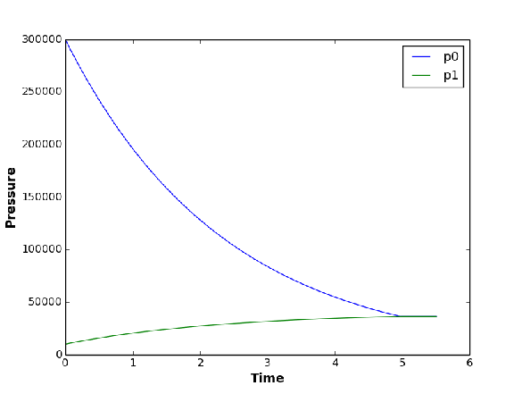{#fig:twoTanks:Pressure}

In order to show that the parameters in equation 2 are changing dynamically throughout the simulation, Figure 9 shows how the value of the parameters change with respect to the iteration number. This is helpful especially in identifying parts of the design space where the surrogate model provides a good approximation.

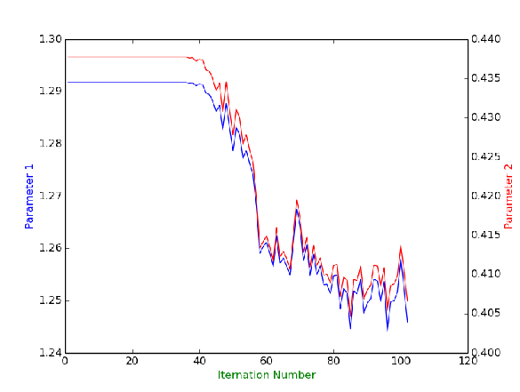{#fig:twoTanks:Params}

The introduction gave an overview ot the example and how the framework facilitates the simulation to be performed in a multi-scale, -equivalent manner. The next sections aims at describing the code initiating and performing the parts of the simulation specific to the -framework.

Initialization
--------------

The <span><span>`initModels`</span></span> script handles the initialization of the twoTank example. First, the relevant and from the interface library, as well as , are imported.

```
from modena import ForwardMappingModel, BackwardMappingModel, SurrogateModel, CFunction
import modena.Strategy as Strategy
import twoTank
from fireworks import Firework, Workflow, LaunchPad
from fireworks.core.rocket_launcher import rapidfire
```

The code block below shows how surrogate functions contains raw <span><span><span style="font-variant:small-caps;">C</span></span></span>-code. The code is automatically compiled and prepared for use, the reason it can be used by the macroscopic models is that the mandatory fields *inputs*, *outputs* and *parameters* can be accessed by the macromodels through adaptors.

```
f = CFunction(
    Ccode= '''
#include "modena.h"
#include "math.h"

void two_tank_flowRate
(
    const double* parameters,
    const double* inherited_inputs,
    const double* inputs,
    double *outputs
)
{
    const double D = inputs[0];
    const double rho0 = inputs[1];
    const double p0 = inputs[2];
    const double p1 = p0*inputs[3];

    const double P0 = parameters[0];
    const double P1 = parameters[1];

    outputs[0] = M_PI*pow(D, 2.0)*P1*sqrt(P0*rho0*p0);
}
''',
    # These are global bounds for the function
    inputs={
        'D': { 'min': 0, 'max': 9e99, 'argPos': 0 },
        'rho0': { 'min': 0, 'max': 9e99, 'argPos': 1 },
        'p0': { 'min': 0, 'max': 9e99, 'argPos': 2 },
        'p1Byp0': { 'min': 0, 'max': 1.0, 'argPos': 3},
    },
    outputs={
        'flowRate': { 'min': 9e99, 'max': -9e99, 'argPos': 0 },
    },
    parameters={
        'param0': { 'min': 0.0, 'max': 10.0, 'argPos': 0 },
        'param1': { 'min': 0.0, 'max': 10.0, 'argPos': 1 },
    },
)
```

The reason for the `CFunction` name is *syntactic sugar* making it possible to provide flexibility for the user to specify surrogate models in different programming languages. The inputs, outputs and parameter dictionaries - which contain the minimum, maximum and the argument positions of the corresponding design variables or parameters - are also stored in the database collection as key and value pairs. The creation of a surrogate function automatically updates the collection surrogate function in <span><span><span style="font-variant:small-caps;">MongoDB</span></span></span>, as explained in Section 5.

When a surrogate function is saved in the database it is ready to be used in a surrogate model. The code block below shows how the backward mapping model in the two tanks example is defined in `initModels`.

```
m = BackwardMappingModel(
    _id= 'flowRate',
    surrogateFunction= f,
    exactTask= twoTank.FlowRateExactSim(),
    substituteModels= [ ],
    initialisationStrategy= Strategy.InitialPoints(
        initialPoints=
        {
            'D': [0.01, 0.01, 0.01, 0.01],
            'rho0': [3.4, 3.5, 3.4, 3.5],
            'p0': [2.8e5, 3.2e5, 2.8e5, 3.2e5],
            'p1Byp0': [0.03, 0.03, 0.04, 0.04],
        },
    ),
    outOfBoundsStrategy= Strategy.ExtendSpaceStochasticSampling(
        nNewPoints= 4
    ),
    parameterFittingStrategy= Strategy.NonLinFitWithErrorContol(
        testDataPercentage= 0.2,
        maxError= 0.05,
        improveErrorStrategy= Strategy.StochasticSampling(
            nNewPoints= 2
        ),
        maxIterations= 5 # Currently not used
    ),
)
```

An instance of the class is created with: the model <span><span>`_id`</span></span>, the base surrogate function, described previously, from <span><span>`twoTank.py`</span></span>, which calls the <span><span>`exactTask`</span></span> of the twoTank example, and the various strategies. It is the surrogate model that is referenced to by the simulation in `twoTanksMacroscopicProblem.C`. The model is found in the database by looking up the <span><span>`_id`</span></span> in the surrogate models collection described in Section 5. Consequently, if the model has not been instantiated the simulation fails. Moreover, the framework will throw an error if the mandatory strategies, e.g. <span><span>`outOfBoundsStrategy`</span></span> and the <span><span>`ParameterFittingStrategy`</span></span>, have not been set. All the strategies are classes defined in the source file *Strategies.py*.

```
# set up the LaunchPad and reset it
launchpad = LaunchPad()
launchpad.reset('', require_password=False)

initFws = []
for m in SurrogateModel.get_instances():
    initFws.append(m.initialisationFw())

# store workflow and launch it locally
launchpad.add_wf(Workflow(initFws, {}, name="initialisation"))
rapidfire(launchpad)
```

Afterwards, the surrogate models are ready to be used and the simulation can be started.

<span>`twoTank.py`</span>
-------------------------

The <span><span>`twoTank.py`</span></span> file contains the two <span><span>`FireTask`</span></span>s that start the microscopic and the macroscopic codes. This file explicitly defines <span><span>`FireTask`</span></span>, this was not done for the surrogate models because they already are defined to be firetasks, but it is hidden from the user for convenience reasons. The result is that the imported modules in <span><span>`twoTank.py`</span></span> are different to those in `initModels`.

```
import os
import modena
from fireworks.user_objects.firetasks.script_task import FireTaskBase, ScriptTask
from fireworks import Firework, Workflow, FWAction
from fireworks.utilities.fw_utilities import explicit_serialize
from blessings import Terminal
```

The necessary imports are the interface library, relevant objects from and a python package providing colored terminal output.

The file defines two firetasks, the first executing the microscopic model and the second executing the macroscopic, both of which are compiled <span><span><span style="font-variant:small-caps;">C</span></span></span> files.

```
@explicit_serialize
class FlowRateExactSim(FireTaskBase):
    """
    A FireTask that starts a microscopic code and updates the database.
    """

    def run_task(self, fw_spec):
        print(
            term.yellow
          + "Performing exact simulation (microscopic code recipe)"
          + term.normal
        )

        D = self['point']['D']
        rho0 = self['point']['rho0']
        p0 = self['point']['p0']
        p1Byp0 = self['point']['p1Byp0']

        # Write input
        f = open('in.txt', 'w')
        f.write('%g\n%g\n%g\n%g\n' % (D, rho0, p0, p1Byp0))
        f.close()

        # Execute the application
        # In this simple example, this call stands for a complex microscopic
        # code - such as full 3D CFD simulation.
        # Source code in src/flowRateExact.C
        os.system('../src/flowRateExact')

        # Analyse output
        f = open('out.txt', 'r')
        self['point']['flowRate'] = float(f.readline())
        f.close()

        return FWAction(mod_spec=[{'_push': self['point']}])
```

The second <span><span>`FireTask`</span></span> starts the macroscopic code at the following command:
However, unlike the microscopic firetask this can end in two ways:
or

```
@explicit_serialize
class ModenaBackwardMappingTask(ScriptTask):
    """
    A FireTask that starts a macroscopic code and catches its return code.
    @author: Henrik Rusche
    """
    required_params = ['script']

    def run_task(self, fw_spec):
        print(
            term.yellow
          + "Performing backward mapping simulation (macroscopic code recipe)"
          + term.normal
        )

        self['defuse_bad_rc'] = True

        # Execute the macroscopic code by calling function in base class
        ret = super(ModenaBackwardMappingTask, self).run_task(fw_spec)

        # Analyse return code

        print('return code = %i' % ret.stored_data['returncode'])
        if ret.stored_data['returncode'] > 199:
            print term.cyan + "Performing Design of Experiments" + term.normal
            model = modena.SurrogateModel.loadFailing()

            return model.outOfBoundsFwAction(
                model,
                self,
                outsidePoint= model.outsidePoint
            )

        else:
            print('We are done')
            return ret
```

The reason why the <span><span>`FireTask`</span></span> has two possible outcomes is because it executes the `twoTanksMacroscopicProblem` code. The two outcomes represents starting design of experiments and parameter fitting, and terminating the entire workflow when the simulation is complete.

Simular to the exact simulation mentioned in the previous code bloc, the backward mapping <span><span>`FireTask`</span></span> is a `ScriptTask`, which helps running non-Python scripts through the command line. The required parameter for this class is `script`. In the twoTank example, the `script` is an executable, i.e. compiled <span><span><span style="font-variant:small-caps;">C</span></span></span>-code, representing the macroscopic `twoTanksMacroscopicProblem`.

However, the workflow itself is initiated in the <span><span>`workflow`</span></span> file shown below.

```
# set up the LaunchPad and reset it
launchpad = LaunchPad()
launchpad.reset('', require_password=False)

# create the individual FireWorks and Workflow
# Source code in src/twoTanksMacroscopicProblem.C
fw1 = Firework(
    ModenaBackwardMappingTask(
        script='../src/twoTanksMacroscopicProblem'
    )
)
wf = Workflow([fw1], {}, name="simulation")

# store workflow and launch it locally
launchpad.add_wf(wf)
rapidfire(launchpad)
```

The <span><span>`LaunchPad`</span></span> is reset so that it can be loaded with the Fireworks. A Firework is created using the class through the macroscopic `script`. A Workflow is then created using this Firework, added to the and executed.

The return code of this macroscopic `script` is caught in the class. The return code indicates whether or not there is an <span><span>`outsidePoint`</span></span>. If there is, it returns the `outOfBoundsFwAction`, meaning that the Design of Experiments is performed. If not, the simulation ends.

Testing on expanding polyurethane foam application
==================================================

In this section, the work on integrating the sub-models, recipes and adaptors originating from WP1-3 is presented. The target application is an expanding polyurethane foam. A novel modelling approach, based on the solution of the population balance equation (<span><span>\(\mathrm{PBE}\)</span></span>), is used and applied for the first time to the simulation of expanding polyurethane foams. The model will be validated against experiments from the literature in WP 6.

Polyurethane foams are widely used materials, employed in many different applications, and almost always manufactured into useful objects via direct injection expanded foam molding Woods (1990; Oertel and Abele 1994; Klempner and Frisch 1991). The final characteristics (i.e. thermal and mechanical properties) of the manufactured objects highly depend on the final bubble (or cell) size distribution (<span><span>\(\mathrm{BSD}\)</span></span>) of the foam Gibson and Ashby (1999). This is determined by the initial chemical recipe (i.e. isocyanate, polyol and blowing agents structure and concentration, catalyst and surfactant type and concentration), the injection dynamics and the flow history of the foam into the mold. However, the relationship between the process conditions and the final foam characteristics is highly empirical and the development of mathematical models is identified as the most efficient way to establish a more reliable and quantitative approach to the problem Niyogi, Kumar, and Gandhi (2014; Beverte 2014; Shen et al. 2014; Zhao et al. 2013; Mosanenzadeh et al. 2013; Zhou, Li, and Huang 2006; Tesser et al. 2004; Lo et al. 1994). Our objective is to develop a three-dimensional model, based on computational fluid dynamics (CFD), capable of simulating the mold filling process. The model also incorporates a population balance equation (<span><span>\(\mathrm{PBE}\)</span></span>) that describes the evolution of the <span><span>\(\mathrm{BSD}\)</span></span> due to bubble growth, caused in turn by physical and chemical blowing agents, and bubble coalescence, caused by shear-induced bubble collisions. The combined use of <span><span>\(\mathrm{PBE}\)</span></span> and CFD was demonstrated to be a very useful tool for the simulation of many different multi-phase systems Marchisio and Fox (2013) and seems a very promising approach also for polyurethane foams. Before developing the full <span><span>\(\mathrm{PBE}\)</span></span>-CFD model and applying it to the three-dimensional simulation of real industrial-scale foaming processes, the <span><span>\(\mathrm{PBE}\)</span></span> model is firstly formulated, implemented in a simpler zero-dimensional framework and partially validated with experiments taken from the literature Baser and Khakhar (1994a; Baser and Khakhar 1994b; Geier, Winkler, and Piesche 2009). The model accounts for the progress of the polymerisation process, between polyol and isocyanate, by tracking the evolution of the gelling reaction. The presence of a physical blowing agent is also accounted for, together with the presence of a chemical blowing agent (i.e. water), and their effect on the <span><span>\(\mathrm{BSD}\)</span></span> is accounted for by solving the <span><span>\(\mathrm{PBE}\)</span></span> with the efficient quadrature method of moments (<span><span>\(\mathrm{QMOM}\)</span></span>) Marchisio and Fox (2013). The remainder of the paper is as follows: after a short description of the model equations, the operating conditions and investigated test cases are discussed. Then, results are presented and some significant conclusions are drawn.

Governing equations
-------------------

For clarity, this section starts with a list of the main simplification assumptions employed in the formulation of the baseline model. It must be noted that since this work tackles a mathematically and physically complex problem with limited information from the literature, some of the following simplifications are required. This baseline model treats the foam as perfectly mixed with a zero-dimensional “lumped” model. The model assumes that the foaming process starts after mixing of the components into a perfectly homogeneous mixture. It is also assumed that the only active bubble formation mechanism is mixing of the components that entraps some air in the mixture. Moreover, the effect of nucleation and spinodal decomposition is assumed to be negligible. The other important simplification is that the complex polymerisation reactions, often described with articulate schemes involving many species and tracking also the polymer weight distribution, is described here with the very simple kinetics scheme detailed below. Only two global reactions are considered. The reaction between polyol and isocyanate to form urethane bonds, responsible for linking the monomers, is called the gelling reaction: 

\[{\ensuremath{\underbrace{{\ensuremath{{\ensuremath{\mathrm{R}}}-{\ensuremath{{\ensuremath{\mathrm{N}}}{\ensuremath{\mathrm{C}}}{\ensuremath{\mathrm{O}}}}}}}}_{\text{Isocyanate}}+\underbrace{{\ensuremath{{\ensuremath{\mathrm{R'}}}-{\ensuremath{{\ensuremath{\mathrm{O}}}{\ensuremath{\mathrm{H}}}}}}}}_{\text{Polyol}}\rightarrow\underbrace{{\ensuremath{{\ensuremath{\mathrm{R}}}-{\ensuremath{\mathrm{N}}}{\ensuremath{\mathrm{H}}}-{\ensuremath{\mathrm{C}}}{\ensuremath{\mathrm{O}}}-{\ensuremath{\mathrm{O}}}-{\ensuremath{\mathrm{R'}}}}}}_{\text{Polyurethane}}}}\label{eq:GellingReaction}\] {#eq:GellingReaction}

The second global reaction, accounted for in this work, is the blowing reaction. This is the reaction between water and isocyanate producing carbon dioxide and forming urea bond. The reaction occurs in two steps with the thermally unstable, intermediate carbamic acid. The decomposition of carbamic acid produces carbon dioxide and amine. The amine group consequently reacts with another isocyanate molecule to form an urea bond. The global reaction reads as follows: 

\[{\ensuremath{2\underbrace{{\ensuremath{{\ensuremath{\mathrm{R}}}-{\ensuremath{{\ensuremath{\mathrm{N}}}{\ensuremath{\mathrm{C}}}{\ensuremath{\mathrm{O}}}}}}}}_{\text{Isocyanate}}+{\ensuremath{{\ensuremath{\mathrm{H}}}_2{\ensuremath{\mathrm{O}}}}}\rightarrow\underbrace{{\ensuremath{{\ensuremath{\mathrm{R}}}-{\ensuremath{\mathrm{N}}}{\ensuremath{\mathrm{H}}}-{\ensuremath{\mathrm{C}}}{\ensuremath{\mathrm{H}}}-{\ensuremath{\mathrm{N}}}{\ensuremath{\mathrm{H}}}-{\ensuremath{\mathrm{R}}}}}}_{\text{Urea}}+{\ensuremath{{\ensuremath{\mathrm{C}}}{\ensuremath{\mathrm{O}}}_2}}}}\label{eq:GlobalReaction}\] {#eq:GlobalReaction}

When the carbon dioxide produced reaches its solubility limit (often assumed constant with respect to temperature and pressure due to lack of data in the literature) gas bubbles already present in the mixture begin to grow. The gelling reaction, reported in equation 3, obeys a first-order kinetic with respect to the concentrations of polyol and isocyanate, resulting in the following rate Winkler (2009; Baser and Khakhar 1994a; Baser and Khakhar 1994b; Geier, Winkler, and Piesche 2009): 

\[{\ensuremath{{\ensuremath{\frac{\mathrm{d}{\ensuremath{{\ensuremath{\mathrm{X}_{{\ensuremath{{\ensuremath{{\ensuremath{\mathrm{O}}}{\ensuremath{\mathrm{H}}}}}}}}}}}}}{\mathrm{d}{\ensuremath{t}}}}}}}=
     {\ensuremath{{\ensuremath{{\ensuremath{A_{{\ensuremath{{\ensuremath{{\ensuremath{\mathrm{O}}}{\ensuremath{\mathrm{H}}}}}}}}}}\exp{\left(\frac{{\ensuremath{E_{{\ensuremath{{\ensuremath{{\ensuremath{\mathrm{O}}}{\ensuremath{\mathrm{H}}}}}}}}}}}{{\ensuremath{R}}{T}}\right)}}}}}{\ensuremath{{\ensuremath{C^0_{{\ensuremath{{\ensuremath{{\ensuremath{\mathrm{O}}}{\ensuremath{\mathrm{H}}}}}}}}}}}}\left( 1-{\ensuremath{{\ensuremath{\mathrm{X}_{{\ensuremath{{\ensuremath{{\ensuremath{\mathrm{O}}}{\ensuremath{\mathrm{H}}}}}}}}}}}}\right)
     \left(
         \frac{ {\ensuremath{{\ensuremath{C^0_{{\ensuremath{{\ensuremath{{\ensuremath{\mathrm{N}}}{\ensuremath{\mathrm{C}}}{\ensuremath{\mathrm{O}}}}}}}}}}}}}{ {\ensuremath{{\ensuremath{C^0_{{\ensuremath{{\ensuremath{{\ensuremath{\mathrm{O}}}{\ensuremath{\mathrm{H}}}}}}}}}}}}} -
         2 \frac{ {\ensuremath{{\ensuremath{C^0_{{\ensuremath{{\ensuremath{{\ensuremath{\mathrm{H}}}_2{\ensuremath{\mathrm{O}}}}}}}}}}}}}{ {\ensuremath{{\ensuremath{C^0_{{\ensuremath{{\ensuremath{{\ensuremath{\mathrm{O}}}{\ensuremath{\mathrm{H}}}}}}}}}}}}} {\ensuremath{{\ensuremath{\mathrm{X}_{{\ensuremath{{\ensuremath{{\ensuremath{\mathrm{H}}}_2{\ensuremath{\mathrm{O}}}}}}}}}}}}-
         {\ensuremath{{\ensuremath{\mathrm{X}_{{\ensuremath{{\ensuremath{{\ensuremath{\mathrm{O}}}{\ensuremath{\mathrm{H}}}}}}}}}}}}\right)\]

 where <span> <span>\(A_{{\ensuremath{{\ensuremath{{\ensuremath{\mathrm{O}}}{\ensuremath{\mathrm{H}}}}}}}}\)</span> </span> and <span> <span>\(E_{{\ensuremath{{\ensuremath{{\ensuremath{\mathrm{O}}}{\ensuremath{\mathrm{H}}}}}}}}\)</span> </span> are the pre-exponential factor and the activation energy, <span> <span>\(R\)</span></span> is the gas constant, <span> <span>T</span></span> is the absolute temperature, <span> <span>\({\ensuremath{\mathrm{X}_{{\ensuremath{{\ensuremath{{\ensuremath{\mathrm{O}}}{\ensuremath{\mathrm{H}}}}}}}}}}\)</span></span> is the conversion of the gelling reaction and <span> <span>\({\ensuremath{C^0_{{\ensuremath{{\ensuremath{{\ensuremath{\mathrm{N}}}{\ensuremath{\mathrm{C}}}{\ensuremath{\mathrm{O}}}}}}}}}}\)</span></span>, <span> <span>\({\ensuremath{C^0_{{\ensuremath{{\ensuremath{{\ensuremath{\mathrm{O}}}{\ensuremath{\mathrm{H}}}}}}}}}}\)</span></span> and \({\ensuremath{{\ensuremath{C^0_{{\ensuremath{{\ensuremath{{\ensuremath{\mathrm{H}}}_2{\ensuremath{\mathrm{O}}}}}}}}}}}}\) are the initial molar concentrations of isocyanate, polyol and water in the reacting mixture. The last two terms between brackets represent the concentrations of polyol and isocyanate, respectively. The global blowing reaction is instead described with a pseudo-first-order model. In fact, since isocyanate is in excess with respect to water, it is assumed that its rate depends only on the concentration of water, resulting in the following expression Winkler (2009; Baser and Khakhar 1994a; Baser and Khakhar 1994b; Geier, Winkler, and Piesche 2009): 

\[{\ensuremath{{\ensuremath{\frac{\mathrm{d}{\ensuremath{{\ensuremath{\mathrm{X}_{{\ensuremath{{\ensuremath{{\ensuremath{\mathrm{H}}}_2{\ensuremath{\mathrm{O}}}}}}}}}}}}}{\mathrm{d}{\ensuremath{t}}}}}}}= {\ensuremath{{\ensuremath{A_{{\ensuremath{{\ensuremath{{\ensuremath{\mathrm{H}}}_2{\ensuremath{\mathrm{O}}}}}}}}}}\exp{\left(\frac{{\ensuremath{E_{{\ensuremath{{\ensuremath{{\ensuremath{\mathrm{H}}}_2{\ensuremath{\mathrm{O}}}}}}}}}}}{{\ensuremath{R}}{T}}\right)}}} ( 1 - {\ensuremath{{\ensuremath{\mathrm{X}_{{\ensuremath{{\ensuremath{{\ensuremath{\mathrm{H}}}_2{\ensuremath{\mathrm{O}}}}}}}}}}}})\]

 where <span> <span>\(A_{{\ensuremath{{\ensuremath{{\ensuremath{\mathrm{H}}}_2{\ensuremath{\mathrm{O}}}}}}}}\)</span> </span> and <span> <span>\(E_{{\ensuremath{{\ensuremath{{\ensuremath{\mathrm{H}}}_2{\ensuremath{\mathrm{O}}}}}}}}\)</span> </span> are the pre-exponential factor and the activation energy and <span> <span>\({\ensuremath{\mathrm{X}_{{\ensuremath{{\ensuremath{{\ensuremath{\mathrm{H}}}_2{\ensuremath{\mathrm{O}}}}}}}}}}\)</span></span> is the conversion of the blowing reaction.

As already mentioned, the blowing reaction produces carbon dioxide (and urea) that diffuses from the bulk of the liquid to the gas bubbles. The mass fraction of carbon dioxide in the liquid of the foam can therefore be calculated as follows: 

\[{\ensuremath{{\ensuremath{\frac{\mathrm{d} {\ensuremath{\mathrm{W}_{{\ensuremath{{\ensuremath{{\ensuremath{\mathrm{C}}}{\ensuremath{\mathrm{O}}}_2}}}}}}}}{\mathrm{d}{\ensuremath{t}}}}}}}= 
        {\ensuremath{{\ensuremath{C^0_{{\ensuremath{{\ensuremath{{\ensuremath{\mathrm{H}}}_2{\ensuremath{\mathrm{O}}}}}}}}}}}}{\ensuremath{{\ensuremath{\frac{\mathrm{d}{\ensuremath{{\ensuremath{\mathrm{X}_{{\ensuremath{{\ensuremath{{\ensuremath{\mathrm{H}}}_2{\ensuremath{\mathrm{O}}}}}}}}}}}}}{\mathrm{d}{\ensuremath{t}}}}}}}\frac{ {\ensuremath{{\ensuremath{Mw_{{\ensuremath{{\ensuremath{{\ensuremath{\mathrm{C}}}{\ensuremath{\mathrm{O}}}_2}}}}}}}}}}{ {\ensuremath{{\ensuremath{\rho_{{\ensuremath{\mathrm{pet}}}}}}}}} -
        {\ensuremath{{\ensuremath{{\ensuremath{\overline{\mathrm{G}}_{1}^{{\ensuremath{{\ensuremath{{\ensuremath{\mathrm{C}}}{\ensuremath{\mathrm{O}}}_2}}}}}}}}}}}{\ensuremath{\frac{{\ensuremath{p}}}{{\ensuremath{R}}{T}}}}\frac{ {\ensuremath{{\ensuremath{Mw_{{\ensuremath{{\ensuremath{{\ensuremath{\mathrm{C}}}{\ensuremath{\mathrm{O}}}_2}}}}}}}}}}{ {\ensuremath{{\ensuremath{\rho_{{\ensuremath{\mathrm{pet}}}}}}}}}\]

 where <span> <span>\(p\)</span></span> is the system pressure (usually assumed constant and equal to the ambient pressure), <span> <span>\({\ensuremath{\rho_{{\ensuremath{\mathrm{pet}}}}}}\)</span></span> is the density of the polymerising liquid mixture (generally assumed constant and equal in this work to \(1100 {{\ensuremath{\left[ g m^{-3} \right]}}}\)) and <span> <span>\({\ensuremath{{\ensuremath{\overline{\mathrm{G}}_{1}^{{\ensuremath{{\ensuremath{{\ensuremath{\mathrm{C}}}{\ensuremath{\mathrm{O}}}_2}}}}}}}}}\)</span></span> is the moment of order one of the growth rate due to carbon dioxide diffusion and will be explained in details later on.

The assumption of constant density (and therefore constant volume) for the liquid will be further discussed later on. The mixture undergoing polymerisation also contains the physical blowing agent that evaporates due to the temperature raise. The mass fraction of the physical blowing agent in the liquid of the foam can be calculated by solving the following equation: 

\[{\ensuremath{{\ensuremath{\frac{\mathrm{d} {\ensuremath{\mathrm{W}_{{\ensuremath{BL}}}}}}{\mathrm{d}{\ensuremath{t}}}}}}}= 
    - {\ensuremath{{\ensuremath{{\ensuremath{\overline{\mathrm{G}}_{1}^{{\ensuremath{BL}}}}}}}}}{\ensuremath{\frac{{\ensuremath{p}}}{{\ensuremath{R}}{T}}}}\frac{ {\ensuremath{{\ensuremath{Mw_{{\ensuremath{BL}}}}}}}}{ {\ensuremath{{\ensuremath{\rho_{{\ensuremath{\mathrm{pet}}}}}}}}} \label{eq:Tiger}\] {#eq:Tiger}

 where <span> <span>\({\ensuremath{{\ensuremath{\overline{\mathrm{G}}_{1}^{{\ensuremath{BL}}}}}}}\)</span></span> is the moment of order one of the growth rate due to the diffusion of the blowing agent and will be also detailed later on. In this case the right-hand side contains only one negative source term, since the physical blowing agent is already present in the liquid and simply disappears due to its diffusion to the gas bubbles.

The temperature of the system is calculated by solving the enthalpy balance for the foam that reads as follows: 

\[{\ensuremath{\mathrm{c}_p}}{\ensuremath{{\ensuremath{\frac{\mathrm{d}{T}}{\mathrm{d}{\ensuremath{t}}}}}}}= 
    {\ensuremath{{\ensuremath{\frac{\mathrm{d}{\ensuremath{{\ensuremath{\mathrm{X}_{{\ensuremath{{\ensuremath{{\ensuremath{\mathrm{H}}}_2{\ensuremath{\mathrm{O}}}}}}}}}}}}}{\mathrm{d}{\ensuremath{t}}}}}}}\left(
        - \frac{ {\ensuremath{\Delta \mathrm{H}_{{\ensuremath{{\ensuremath{{\ensuremath{\mathrm{H}}}_2{\ensuremath{\mathrm{O}}}}}}}}}} {\ensuremath{{\ensuremath{C^0_{{\ensuremath{{\ensuremath{{\ensuremath{\mathrm{H}}}_2{\ensuremath{\mathrm{O}}}}}}}}}}}}}{ {\ensuremath{{\ensuremath{\rho_{{\ensuremath{\mathrm{pet}}}}}}}}}
    \right) +     {\ensuremath{{\ensuremath{\frac{\mathrm{d}{\ensuremath{{\ensuremath{\mathrm{X}_{{\ensuremath{{\ensuremath{{\ensuremath{\mathrm{O}}}{\ensuremath{\mathrm{H}}}}}}}}}}}}}{\mathrm{d}{\ensuremath{t}}}}}}}\left(
        - \frac{ {\ensuremath{\Delta \mathrm{H}_{{\ensuremath{{\ensuremath{{\ensuremath{\mathrm{O}}}{\ensuremath{\mathrm{H}}}}}}}}}} {\ensuremath{{\ensuremath{C^0_{{\ensuremath{{\ensuremath{{\ensuremath{\mathrm{O}}}{\ensuremath{\mathrm{H}}}}}}}}}}}}}{ {\ensuremath{{\ensuremath{\rho_{{\ensuremath{\mathrm{pet}}}}}}}}}
    \right) +
    \left( -{\ensuremath{\lambda}}\right)
    {\ensuremath{{\ensuremath{\frac{\mathrm{d} {\ensuremath{\mathrm{W}_{{\ensuremath{BL}}}}}}{\mathrm{d}{\ensuremath{t}}}}}}}\]

 where <span> <span>\(\mathrm{c}_p\)</span></span> is the specific heat of the foam (taken in this work constant and equal to \(1800 {{\ensuremath{\left[ J kg^{-1} K^{-1} \right]}}}\)), <span> <span>\(\lambda\)</span></span> is the latent heat of evaporation of the blowing agent, <span> <span>\(\Delta \mathrm{H}_{{\ensuremath{{\ensuremath{{\ensuremath{\mathrm{H}}}_2{\ensuremath{\mathrm{O}}}}}}}}\)</span></span> and <span> <span>\(\Delta \mathrm{H}_{{\ensuremath{{\ensuremath{{\ensuremath{\mathrm{O}}}{\ensuremath{\mathrm{H}}}}}}}}\)</span></span> are the heats of reaction for the blowing and gelling reactions respectively and <span> <span>\({\ensuremath{\frac{\mathrm{d} {\ensuremath{\mathrm{W}_{{\ensuremath{BL}}}}}}{\mathrm{d}{\ensuremath{t}}}}}\)</span></span> is the rate of change of the mass fraction of dissolved blowing agent in the liquid, as detailed in Equation 5.

As already mentioned, the model adopted in this work is based on a <span><span>\(\mathrm{PBE}\)</span></span>, which describes the evolution of the <span><span>\(\mathrm{BSD}\)</span></span> of the bubbles, or cells, of the foam. This function is defined in such a way that: <span> </span>, represents the number of bubbles with volume in the infinitesimal size range between <span> <span>\(\mathrm{v}\)</span></span> and <span> </span>, per unit volume of the liquid mixture undergoing polymerisation. Very often instead of tracking the evolution of the <span><span>\(\mathrm{BSD}\)</span></span> the problem is reformulated in terms of the moments of the <span><span>\(\mathrm{BSD}\)</span></span>. The generic moment of order <span> <span>\(\mathrm{k}\)</span></span> is defined as follows: 

\[{\ensuremath{{{\ensuremath{{\ensuremath{\mathrm{m}_{k}}}}}}\left( {\ensuremath{t}}\right)}} = 
    {\ensuremath{\int_{0}^{\infty} {\ensuremath{n\left({{\ensuremath{\mathrm{v}}},{\ensuremath{t}}}\right)}} {\ensuremath{\mathrm{v}}}^{\ensuremath{\mathrm{k}}}\mathrm{d}{\ensuremath{\mathrm{v}}}}}\]

 Each moment has a specific physical meaning: <span> <span>\({\ensuremath{\mathrm{m}_{0}}}\)</span></span> represents the total bubble number density (i.e. total number of bubbles per unit volume of the liquid of the foam), <span> <span>\({\ensuremath{\mathrm{m}_{1}}}\)</span></span> represents the total bubble volume per unit volume of liquid mixture whereas <span> <span>\({\ensuremath{\mathrm{m}_{2}}}\)</span></span> is related to the variance of the <span><span>\(\mathrm{BSD}\)</span></span>. Being the polyurethane foam constituted by the liquid and the gas bubbles, in order to estimate the moments of the <span><span>\(\mathrm{BSD}\)</span></span> per unit volume of the foam the following transform is necessary: 

\[{\ensuremath{{{\ensuremath{{\ensuremath{\mathrm{M}_{k}}}}}}\left( {\ensuremath{t}}\right)}} = 
       \frac{{\ensuremath{{{\ensuremath{{\ensuremath{\mathrm{m}_{k}}}}}}\left( {\ensuremath{t}}\right)}} }{ 1 + {\ensuremath{{{\ensuremath{{\ensuremath{\mathrm{m}_{1}}}}}}\left( {\ensuremath{t}}\right)}} }\]

 where <span> <span>\({\ensuremath{\mathrm{M}_{k}}}\)</span></span> is the moment of the <span><span>\(\mathrm{BSD}\)</span></span> based on the total volume of the foam. By using this notation the density of the foam can be readily calculated as follows: 

\[{\ensuremath{\rho_{{\ensuremath{foam}}}}} = 
    {\ensuremath{\rho_{{\ensuremath{\mathrm{gas}}}}}}
    \left[
        \frac{{\ensuremath{{{\ensuremath{{\ensuremath{\mathrm{m}_{1}}}}}}\left( {\ensuremath{t}}\right)}} }{ 1 + {\ensuremath{{{\ensuremath{{\ensuremath{\mathrm{m}_{1}}}}}}\left( {\ensuremath{t}}\right)}} } 
    \right] +
    {\ensuremath{{\ensuremath{\rho_{{\ensuremath{\mathrm{pet}}}}}}}}\left[
        \frac{ 1 }{ 1 + {\ensuremath{{{\ensuremath{{\ensuremath{\mathrm{m}_{1}}}}}}\left( {\ensuremath{t}}\right)}} } 
    \right]\]

 where <span> <span>\(\rho_{{\ensuremath{\mathrm{gas}}}}\)</span></span> is the density of the gas constituting the bubbles (calculated with the ideal gas law) whereas <span> <span>\({\ensuremath{\rho_{{\ensuremath{\mathrm{pet}}}}}}\)</span></span> is the density of the liquid mixture. The density of the liquid mixture undergoing polymerisation changes in time, as it is a function of composition, temperature and degree of polymerisation. Although a detailed model for describing these dependencies is under development, as already mentioned, for the moment this density is assumed constant. This is justified by the fact that while the foam expands, its behavior is dominated by the produced gas, rather than by the liquid phase. Therefore the error associated with this assumption is considered acceptable for this baseline model. The mean bubble (or cell) size is instead calculated as follows: 

\[{\ensuremath{\mathrm{d}_b}}= \left( \frac{6}{\pi} \frac{{\ensuremath{{\ensuremath{\mathrm{m}_{1}}}}}}{{\ensuremath{{\ensuremath{\mathrm{m}_{0}}}}}} \right)\]

 The evolution of the <span><span>\(\mathrm{BSD}\)</span></span> is dictated by the <span><span>\(\mathrm{PBE}\)</span></span> that reads as follows (time dependencies are omitted for brevity): 

\[\frac{\partial {\ensuremath{n\left({{\ensuremath{\mathrm{v}}}}\right)}} }{ \partial {\ensuremath{t}}} + 
    \frac{\partial }{ \partial {\ensuremath{\mathrm{v}}}} \left[ 
                                                  {\ensuremath{{{\ensuremath{\mathrm{G}}}}\left( {\ensuremath{\mathrm{v}}}\right)}} 
                                                  {\ensuremath{n\left({{\ensuremath{\mathrm{v}}}}\right)}}
                                              \right] 
        \frac{1}{2} 
    {\ensuremath{\int_{0}^{{\ensuremath{\mathrm{v}}}}
        {\ensuremath{{{\ensuremath{\beta}}}\left( {\ensuremath{\mathrm{v}}}', {\ensuremath{\mathrm{v}}}- {\ensuremath{\mathrm{v}}}' \right)}} 
        {\ensuremath{n\left({{\ensuremath{\mathrm{v}}}'}\right)}}
        {\ensuremath{n\left({{\ensuremath{\mathrm{v}}}- {\ensuremath{\mathrm{v}}}'}\right)}}
        \mathrm{d}{\ensuremath{\mathrm{v}}}'}} - 
    {\ensuremath{\int_{0}^{+\infty}
        {\ensuremath{{{\ensuremath{\beta}}}\left( {\ensuremath{\mathrm{v}}}', {\ensuremath{\mathrm{v}}}' \right)}} 
        {\ensuremath{n\left({{\ensuremath{\mathrm{v}}}}\right)}}
        {\ensuremath{n\left({{\ensuremath{\mathrm{v}}}'}\right)}}
        \mathrm{d}{\ensuremath{\mathrm{v}}}'}}\]

 where <span> <span>\(\mathrm{G}\)</span></span> is the so-called bubble growth rate and <span> <span>\(\beta\)</span></span> is the bubble coalescence kernel. The first term on the left-hand side represents accumulation, the second bubble growth, whereas the two terms on the right-hand side represent the formation and disappearance of bubbles due to coalescence.

The bubble growth rate is due to the diffusion of the physical blowing agent and of the carbon dioxide molecules to the gas bubbles of the foam. Although several detailed models can be formulated, in this work it is assumed that the growth of the bubbles is diffusion-controlled. The rate of diffusion-controlled growth processes is generally assumed to be proportional to the driving force around the bubble (i.e. concentration gradient). The proportionality constant can be theoretically calculated *a-priori* if the diffusion coefficients of the physical blowing agent and of carbon dioxide in the liquid mixture undergoing polymerisation are known. The overall growth rate is therefore calculated as the summation of the growth rate due to the blowing agent: 

\[{\ensuremath{{{\ensuremath{\mathrm{G}}}^{{\ensuremath{BL}}}}\left( {\ensuremath{\mathrm{v}}}\right)}} =
    {\ensuremath{{\ensuremath{c_{{\ensuremath{BL}}}}}}}\left(
        \frac{ {\ensuremath{{\ensuremath{\mathrm{W}_{{\ensuremath{BL}}}}}}}- {\ensuremath{{\ensuremath{\mathrm{W}^D_{{\ensuremath{BL}}}}}}}}{ {\ensuremath{{\ensuremath{\mathrm{W}^D_{{\ensuremath{BL}}}}}}}}
    \right)\]

 and due to carbon dioxide: 

\[{\ensuremath{{{\ensuremath{\mathrm{G}}}^{{\ensuremath{{\ensuremath{{\ensuremath{\mathrm{C}}}{\ensuremath{\mathrm{O}}}_2}}}}}}\left( {\ensuremath{\mathrm{v}}}\right)}} =
    {\ensuremath{{\ensuremath{c_{{\ensuremath{{\ensuremath{\mathrm{C}}}{\ensuremath{\mathrm{O}}}_2}}}}}}}\left(
        \frac{ {\ensuremath{{\ensuremath{\mathrm{W}_{{\ensuremath{{\ensuremath{{\ensuremath{\mathrm{C}}}{\ensuremath{\mathrm{O}}}_2}}}}}}}}}- {\ensuremath{{\ensuremath{\mathrm{W}^D_{{\ensuremath{{\ensuremath{{\ensuremath{\mathrm{C}}}{\ensuremath{\mathrm{O}}}_2}}}}}}}}}}{ {\ensuremath{{\ensuremath{\mathrm{W}^D_{{\ensuremath{{\ensuremath{{\ensuremath{\mathrm{C}}}{\ensuremath{\mathrm{O}}}_2}}}}}}}}}}
    \right)\]

 where <span> <span>\({\ensuremath{\mathrm{W}_{{\ensuremath{BL}}}}}\)</span></span> and <span> <span>\({\ensuremath{\mathrm{W}_{{\ensuremath{{\ensuremath{{\ensuremath{\mathrm{C}}}{\ensuremath{\mathrm{O}}}_2}}}}}}}\)</span></span> are the mass fractions of blowing agent and carbon dioxide in the liquid phase of the foam, whereas <span> <span>\({\ensuremath{\mathrm{W}^D_{{\ensuremath{BL}}}}}\)</span></span> and <span> <span>\({\ensuremath{\mathrm{W}^D_{{\ensuremath{{\ensuremath{{\ensuremath{\mathrm{C}}}{\ensuremath{\mathrm{O}}}_2}}}}}}}\)</span></span> are the corresponding equilibrium concentrations (which depend on the system temperature, <span> <span>T</span></span>). The proportionality constants <span> <span>\({\ensuremath{c_{{\ensuremath{BL}}}}}\)</span></span> and <span> <span>\({\ensuremath{c_{{\ensuremath{{\ensuremath{\mathrm{C}}}{\ensuremath{\mathrm{O}}}_2}}}}}\)</span></span> are treated in this work as model parameters and are varied between \(10-14\) and \(10-12\ [m^3 s^{-1}]\), as these values correspond to reasonable diffusion coefficient values. Bubble coalescence is caused by the relative motion of the bubbles, due to shear and velocity gradients, that inevitably are imposed during the expansion of the foam. For shear-induced coalescence the resulting rate is expressed by the following sum kernelMarchisio and Fox (2013): 

\[{\ensuremath{{{\ensuremath{\beta}}}\left( {\ensuremath{\mathrm{v}}}, {\ensuremath{\mathrm{v}}}' \right)}} = {\ensuremath{{{\ensuremath{\beta_0}}}\left(  {\ensuremath{\mathrm{v}}}+ {\ensuremath{\mathrm{v}}}' \right)}}\]

 where <span> <span>\(\beta_0\)</span></span> is proportional to the local shear rate and therefore depends on the flow conditions. As in this work the foam expansion is described via a simple zero-dimensional model this value is assumed constant and varied between \(10^{-3}\) and \(10^{-2}\ [s^{-1}]\), corresponding to reasonable values for foam expansion flows.

By applying the moment transform the <span><span>\(\mathrm{PBE}\)</span></span> becomes: 

\[{\ensuremath{{\ensuremath{\frac{\mathrm{d}{\ensuremath{{\ensuremath{\mathrm{m}_{k}}}}}}{\mathrm{d}{\ensuremath{t}}}}}}}= {\ensuremath{\mathrm{k}}}\left(  {\ensuremath{{\ensuremath{{\ensuremath{\overline{\mathrm{G}}_{{\ensuremath{\mathrm{k}}}}^{{\ensuremath{BL}}}}}}}}}+ {\ensuremath{{\ensuremath{{\ensuremath{\overline{\mathrm{G}}_{{\ensuremath{\mathrm{k}}}}^{{\ensuremath{{\ensuremath{{\ensuremath{\mathrm{C}}}{\ensuremath{\mathrm{O}}}_2}}}}}}}}}}}\right) +  {\ensuremath{\overline{\mathrm{S}}_k}}\] 

where the moment of order <span> <span>\(\mathrm{k}\)</span></span> of the growth rates are defined as follows: 

\[\begin{aligned}
    {\ensuremath{{\ensuremath{{\ensuremath{\overline{\mathrm{G}}_{{\ensuremath{\mathrm{k}}}}^{{\ensuremath{BL}}}}}}}}}&= 
                                     {\ensuremath{\int_{0}^{+\infty}
                                                       {\ensuremath{{{\ensuremath{\mathrm{G}}}^{{\ensuremath{BL}}}}\left( {\ensuremath{\mathrm{v}}}\right)}}
                                                       {\ensuremath{n\left({{\ensuremath{\mathrm{v}}}, {\ensuremath{t}}}\right)}}
                                                       {\ensuremath{\mathrm{v}}}^{{\ensuremath{\mathrm{k}}}-1}                                     
                                     \mathrm{d}{\ensuremath{\mathrm{v}}}}} \\
        {\ensuremath{{\ensuremath{{\ensuremath{\overline{\mathrm{G}}_{{\ensuremath{\mathrm{k}}}}^{{\ensuremath{BL}}}}}}}}}&= 
                                     {\ensuremath{\int_{0}^{+\infty}
                                                        {\ensuremath{{{\ensuremath{\mathrm{G}}}^{{\ensuremath{{\ensuremath{{\ensuremath{\mathrm{C}}}{\ensuremath{\mathrm{O}}}_2}}}}}}\left( {\ensuremath{\mathrm{v}}}\right)}}
                                                        {\ensuremath{n\left({{\ensuremath{\mathrm{v}}}, {\ensuremath{t}}}\right)}}
                                                        {\ensuremath{\mathrm{v}}}^{{\ensuremath{\mathrm{k}}}-1}
                                     \mathrm{d}{\ensuremath{\mathrm{v}}}}}\end{aligned}\]

 whereas the moment of order <span> <span>\(\mathrm{k}\)</span></span> of the source term due to coalescence reads as follows: 

\[{\ensuremath{\overline{\mathrm{S}}_k}}=
        {\ensuremath{\int_{0}^{+\infty}
                        {\ensuremath{\int_{0}^{+\infty}
                                        \left[
                                            \left(
                                                {\ensuremath{\mathrm{v}}}+ {\ensuremath{\mathrm{v}}}'
                                            \right)^{{\ensuremath{\mathrm{k}}}} - {\ensuremath{\mathrm{v}}}^{\ensuremath{\mathrm{k}}}- {\ensuremath{\mathrm{v}}}'\ ^{\ensuremath{\mathrm{k}}}\right]
                                        {\ensuremath{{{\ensuremath{\beta}}}\left( {\ensuremath{\mathrm{v}}},{\ensuremath{\mathrm{v}}}' \right)}}
                                        {\ensuremath{n\left({{\ensuremath{\mathrm{v}}}}\right)}}
                                        {\ensuremath{n\left({{\ensuremath{\mathrm{v}}}'}\right)}}
                                       \mathrm{d}{\ensuremath{\mathrm{v}}}}}
                       \mathrm{d}{\ensuremath{\mathrm{v}}}'}}\]

 These latter source terms are calculated by using <span><span>\(\mathrm{QMOM}\)</span></span>, which transforms these complex integrals into simple summations Marchisio and Fox (2013): 

\[\begin{aligned}
    {\ensuremath{{\ensuremath{{\ensuremath{\overline{\mathrm{G}}_{{\ensuremath{\mathrm{k}}}}^{{\ensuremath{BL}}}}}}}}}&\approx \sum_{\alpha=1}^{{\ensuremath{\mathrm{N}}}} {\ensuremath{w_{\alpha}}}
                                                 {\ensuremath{{{\ensuremath{\mathrm{G}}}^{{\ensuremath{BL}}}}\left( {\ensuremath{\nu_{\alpha}}} \right)}}
                                                 {\ensuremath{n\left({{\ensuremath{\nu_{\alpha}}}, {\ensuremath{t}}}\right)}}
                                                 {\ensuremath{\mathrm{v}}}^{{\ensuremath{\mathrm{k}}}-1}                                     
   \\
        {\ensuremath{{\ensuremath{{\ensuremath{\overline{\mathrm{G}}_{{\ensuremath{\mathrm{k}}}}^{{\ensuremath{BL}}}}}}}}}&\approx \sum_{\alpha=1}^{{\ensuremath{\mathrm{N}}}} {\ensuremath{w_{\alpha}}}
                                                 {\ensuremath{{{\ensuremath{\mathrm{G}}}^{{\ensuremath{{\ensuremath{{\ensuremath{\mathrm{C}}}{\ensuremath{\mathrm{O}}}_2}}}}}}\left( {\ensuremath{\nu_{\alpha}}} \right)}}
                                                 {\ensuremath{n\left({{\ensuremath{\nu_{\alpha}}}, {\ensuremath{t}}}\right)}}
                                                 {\ensuremath{\mathrm{v}}}^{{\ensuremath{\mathrm{k}}}-1}\end{aligned}\]

 and: 

\[{\ensuremath{\overline{\mathrm{S}}_k}}\approx 
        \sum_{\alpha=1}^{{\ensuremath{\mathrm{N}}}}
            \sum_{\beta=1}^{{\ensuremath{\mathrm{N}}}} {\ensuremath{{\ensuremath{w_{\alpha}}}}}{\ensuremath{{\ensuremath{w_{\beta}}}}}\left[
                     \left(
                           {\ensuremath{{\ensuremath{\nu_{\alpha}}}}}+ {\ensuremath{{\ensuremath{\nu_{\beta}}}}}\right)^{{\ensuremath{\mathrm{k}}}} - {\ensuremath{{\ensuremath{\nu_{\alpha}}}}}^{\ensuremath{\mathrm{k}}}- {\ensuremath{{\ensuremath{\nu_{\beta}}}}}\ ^{\ensuremath{\mathrm{k}}}\right]
                {\ensuremath{{{\ensuremath{\beta}}}\left( {\ensuremath{{\ensuremath{\nu_{\alpha}}}}}, {\ensuremath{{\ensuremath{\nu_{\beta}}}}}\right)}}\]

 where <span> <span>\({\ensuremath{w_{\alpha}}}\)</span></span>, <span> <span>\({\ensuremath{w_{\beta}}}\)</span></span> and <span> <span>\({\ensuremath{\nu_{\alpha}}}\)</span></span> , <span> <span>\({\ensuremath{\nu_{\beta}}}\)</span></span> are the <span> <span>\(\mathrm{N}\)</span></span> weights and nodes of the quadrature approximation.

For standard applications involving growth and coalescence usually <span> </span>, requires the solution of the first four moments of the <span><span>\(\mathrm{BSD}\)</span></span> (i.e. <span> <span>\({\ensuremath{\mathrm{m}_{0}}}\)</span></span>, <span> <span>\({\ensuremath{\mathrm{m}_{1}}}\)</span></span>, <span> <span>\({\ensuremath{\mathrm{m}_{2}}}\)</span></span> and <span> <span>\({\ensuremath{\mathrm{m}_{3}}}\)</span></span>).

Status of recipes and adaptors
------------------------------

The figures below describes the recipes and adaptors (links) that are being included into the expanding polyurethane foam application described in the previous section. Boxes and ellipses stand for tools and surrogate models, respectively. Arrows indicate the flow of data forwards and backwards across scales. It should be noted that this only represents the first step which will be enhanced and augmented.

|                                                                                                                                                                                                                                                                      |                                                                                                                                                                                                                                                                      |
|:--------------------------------------------------------------------------------------------------------------------------------------------------------------------------------------------------------------------------------------------------------------------:|:--------------------------------------------------------------------------------------------------------------------------------------------------------------------------------------------------------------------------------------------------------------------:|
| 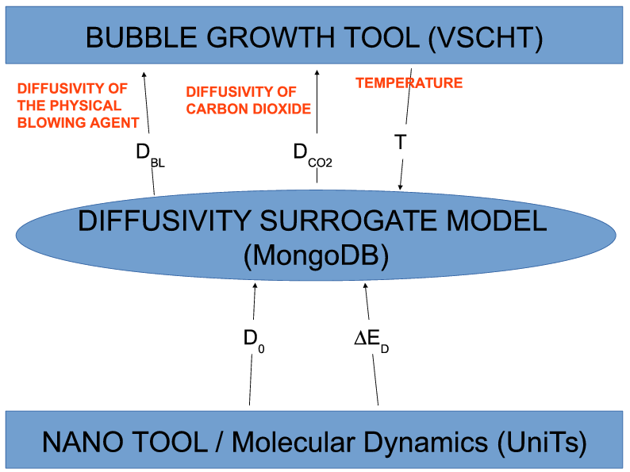 | 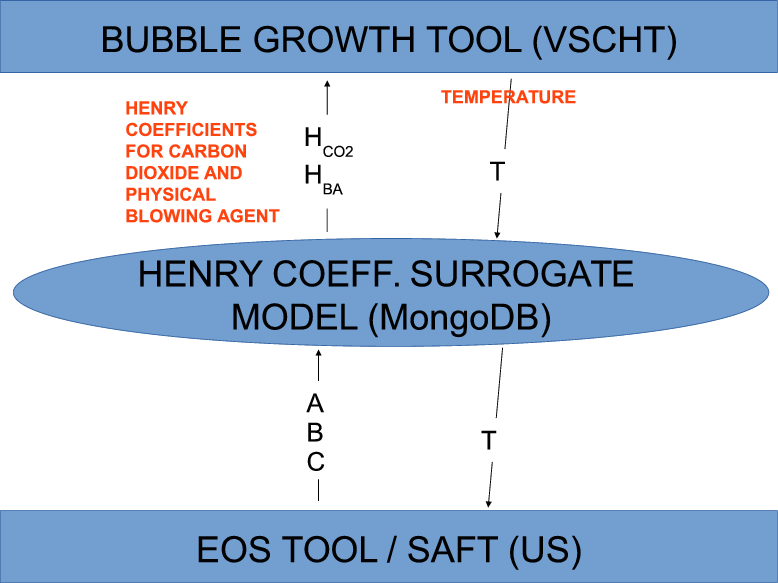 |
| 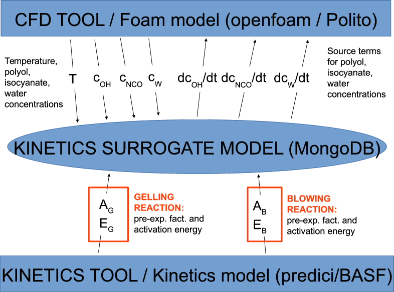 | 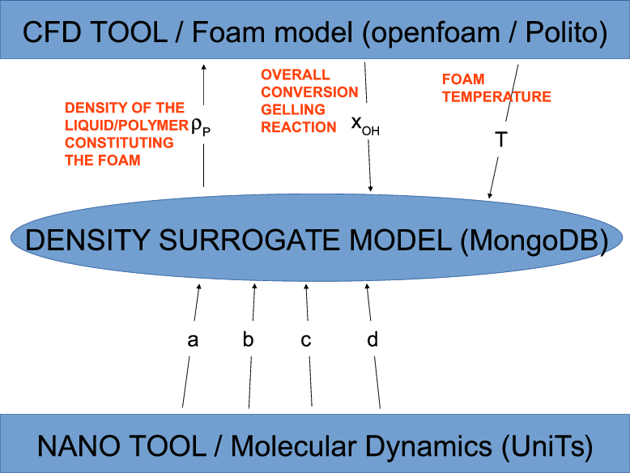 |
| 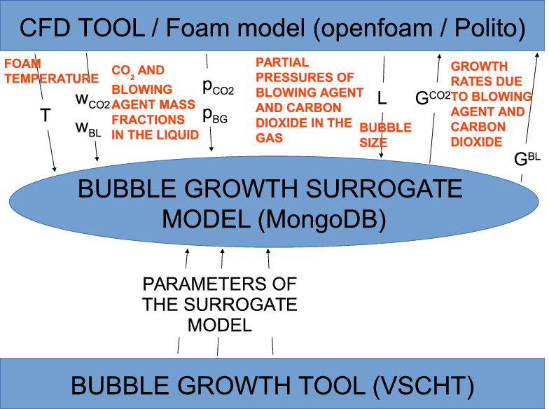 | 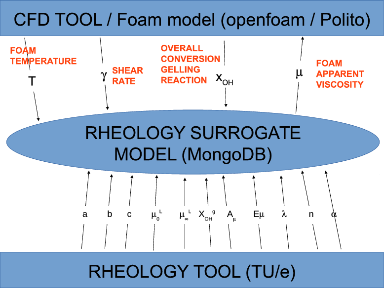 |

The status of the recipes and adaptors (links) is summarised in Figure [@fig:recipesAdaptorsStatus]. There are 6 tools (computational fluid dynamics, bubble growth tool, kinetics, equation of statem nano and rheology) that are to be orchestrated in this application. 5 of the 6 tools and 3 of the 6 links are operational and have undergone testing. It is envisaged that the remaining ones will be operational for the mid-term.

The majority tools and links scheduled for implementation in the first application development phase are operational and have undergone testing. The final model predictions will validated against experiments in WP6.

|                                                                                                                                    |                                                                                                                                    |
|:----------------------------------------------------------------------------------------------------------------------------------:|:----------------------------------------------------------------------------------------------------------------------------------:|
| 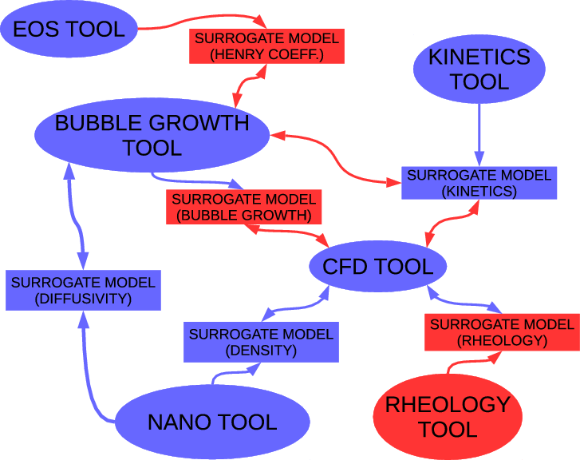 | 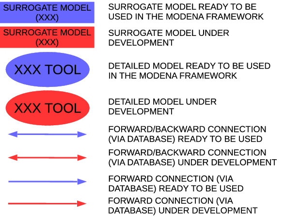 |

References
==========

Baser, S. A., and D. V. Khakhar. 1994a. “Modeling of the Dynamics of R-11 Blown Polyurethane Foam Formation.” *Polymer Engineering & Science* 34 (8): 632–641. doi:[10.1002/pen.760340804](http://dx.doi.org/10.1002/pen.760340804). <http://dx.doi.org/10.1002/pen.760340804>.

———. 1994b. “Modeling of the Dynamics of R-11 Blown Polyurethane Foam Formation.” *Polymer Engineering & Science* 34 (8): 642–649. doi:[10.1002/pen.760340804](http://dx.doi.org/10.1002/pen.760340804). <http://dx.doi.org/10.1002/pen.760340804>.

Beverte, Ilze. 2014. “Determination of Highly Porous Plastic Foam Structural Characteristics by Processing Light Microscopy Images Data.” *Journal of Applied Polymer Science* 131 (4): n/a–n/a. doi:[10.1002/app.39477](http://dx.doi.org/10.1002/app.39477). <http://dx.doi.org/10.1002/app.39477>.

Chemieingenieurwesen, VDI-Gesellschaft Verfahrenstechnik und. 2010. *VDI Heat Atlas; 2nd Ed.* Berlin: Springer.

Codd, Edgar F. 1970. “A Relational Model of Data for Large Shared Data Banks.” *Communications of the ACM* 13 (6): 377–387.

Geier, S., C. Winkler, and M. Piesche. 2009. “Numerical Simulation of Mold Filling Processes with Polyurethane Foams.” *Chemical Engineering & Technology* 32 (9): 1438–1447. doi:[10.1002/ceat.200900202](http://dx.doi.org/10.1002/ceat.200900202). <http://dx.doi.org/10.1002/ceat.200900202>.

Gibson, L.J., and M.F. Ashby. 1999. *Cellular Solids: Structure and Properties*. Cambridge Solid State Science Series. Cambridge University Press. <https://books.google.no/books?id=IySUr5sn4N8C>.

Klempner, D., and K.C. Frisch. 1991. *Handbook of Polymeric Foams and Foam Technology*. Hanser Gardner Publications. <http://books.google.no/books?id=QbcZHAAACAAJ>.

Lo, Yu-Wen, Danny D. Reible, John R. Collier, and Cheng-Ho Chen. 1994. “Three-Dimensional Modeling of Reaction Injection Molding. I.” *Polymer Engineering & Science* 34 (18): 1393–1400. doi:[10.1002/pen.760341805](http://dx.doi.org/10.1002/pen.760341805). <http://dx.doi.org/10.1002/pen.760341805>.

Marchisio, D.L., and R.O. Fox. 2013. *Computational Models for Polydisperse Particulate and Multiphase Systems*. Cambridge Series in Chemical Engineering. Cambridge University Press.

Mosanenzadeh, Shahrzad Ghaffari, Hani E. Naguib, Chul B. Park, and Noureddine Atalla. 2013. “Development, Characterization, and Modeling of Environmentally Friendly Open-Cell Acoustic Foams.” *Polymer Engineering & Science* 53 (9): 1979–1989. doi:[10.1002/pen.23443](http://dx.doi.org/10.1002/pen.23443). <http://dx.doi.org/10.1002/pen.23443>.

N<span>ä</span>sholm, Petter. 2012. “Extracting Data from NoSQL Databases-a Step Towards Interactive Visual Analysis of NoSQL Data.” Master’s thesis, Chalmers University of Technology.

Niyogi, Debdarsan, Rajinder Kumar, and Kandukuri S. Gandhi. 2014. “Modeling of Bubble-Size Distribution in Water and Freon Co-Blown Free Rise Polyurethane Foams.” *Journal of Applied Polymer Science* 131 (18): n/a–n/a. doi:[10.1002/app.40745](http://dx.doi.org/10.1002/app.40745). <http://dx.doi.org/10.1002/app.40745>.

Oertel, G., and L. Abele. 1994. *Polyurethane Handbook: Chemistry, Raw Materials, Processing, Application, Properties*. Hanser.

project, Fireworks. 2015. “Project Web-Site.” march. <http://pythonhosted.org/FireWorks/>.

project, MongoDB. 2015. “Project Web-Site.” march. <http://www.mongodb.org/>.

Project, MongoDB Documentation. 2014. *MongoDB Documentation*. <http://docs.mongodb.org/master/MongoDB-manual.pdf>.

project, MongoEngine. 2015. “Project Web-Site.” march. <http://www.mongoengine.org/>.

project, R. 2015. “Project Web-Site.” march. <http://www.r-project.org/>.

Shen, Lu, Yusheng Zhao, Ali Tekeei, Fu-Hung Hsieh, and Galen J. Suppes. 2014. “Density Modeling of Polyurethane Box Foam.” *Polymer Engineering & Science* 54 (7): 1503–1511. doi:[10.1002/pen.23694](http://dx.doi.org/10.1002/pen.23694). <http://dx.doi.org/10.1002/pen.23694>.

Shermin, Motahera. 2013. “An Access Control Model for NoSQL Databases.” Master’s thesis, University of Western Ontario.

Tesser, R., M. Di Serio, A. Sclafani, and E. Santacesaria. 2004. “Modeling of Polyurethane Foam Formation.” *Journal of Applied Polymer Science* 92 (3): 1875–1886. doi:[10.1002/app.20170](http://dx.doi.org/10.1002/app.20170). <http://dx.doi.org/10.1002/app.20170>.

Winkler, Christian A. 2009. “PhD Thesis.” PhD thesis, University of Stuttgart.

Woods, George. 1990. *Polyurethane Handbook: Chemistry, Raw Materials, Processing, Application, Properties*. ICI Polyurethanes; Wiley in Chichester, New York .

Zhao, Yusheng, Michael J. Gordon, Ali Tekeei, Fu-Hung Hsieh, and Galen J. Suppes. 2013. “Modeling Reaction Kinetics of Rigid Polyurethane Foaming Process.” *Journal of Applied Polymer Science* 130 (2): 1131–1138. doi:[10.1002/app.39287](http://dx.doi.org/10.1002/app.39287). <http://dx.doi.org/10.1002/app.39287>.

Zhou, Hong, Bo Li, and Guangsu Huang. 2006. “Sound Absorption Characteristics of Polymer Microparticles.” *Journal of Applied Polymer Science* 101 (4): 2675–2679. doi:[10.1002/app.23911](http://dx.doi.org/10.1002/app.23911). <http://dx.doi.org/10.1002/app.23911>.
